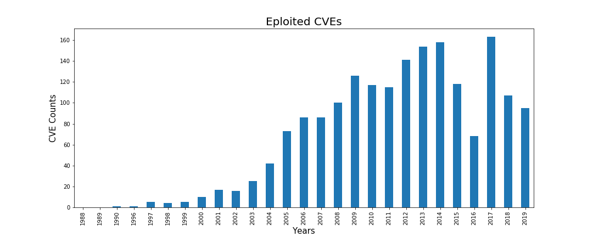
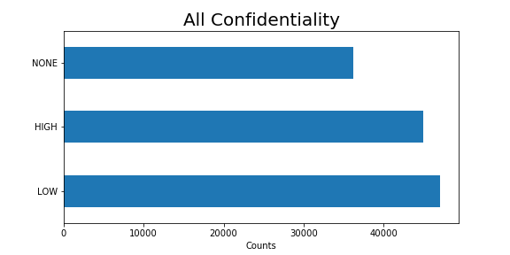
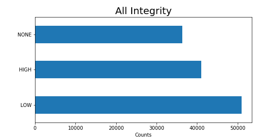
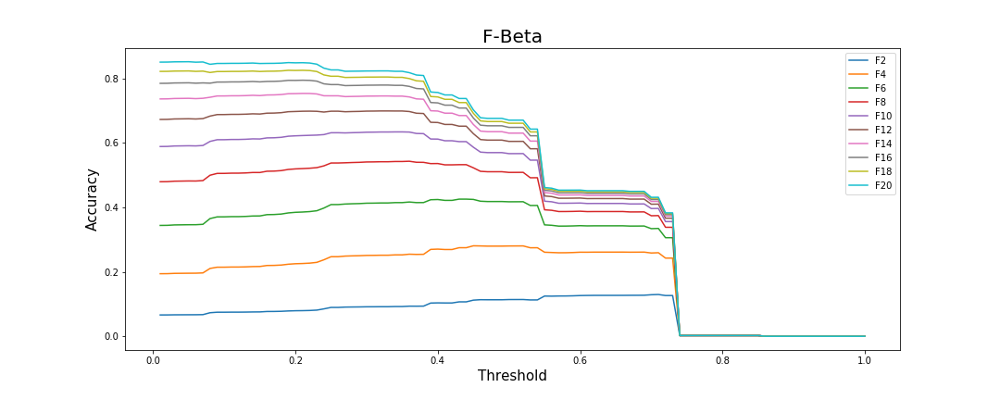

# Machine Learning Engineer Nanodegree

## Capstone Project

Kenneth R. Farr III

July 28th, 2018

## I. Definition

### Project Overview

Cyber Security is the domain that focuses on cost-effectively reducing losses in and around digital assets.  This includes accidental losses caused by mistakenly emailing confidential information, and malicious losses such as a stolen mobile device or a breached database.  A popular modeling technique for computing the risk (dollars lost per year) of an asset is the [Factor Analysis of Information Risk (FAIR)](https://en.wikipedia.org/wiki/Factor_analysis_of_information_risk) ontology.  This model accepts as input the frequency of a loss event (how often a loss is expected to occur) and the loss magnitude (when a loss occurs, how much does it cost the organization).

A Cyber security industry standard exists to catalog all known vulnerabilities:  [Common Vulnerabilities and Exposures (CVE)](https://cve.mitre.org/).  The CVE list details every known vulnerability and applies attributes to them, such as level of involvement to exploit, closeness to the asset (physical presence, adjacent network, internet) etc.  These elemental attributes are used to derive a Common Vulnerability Scoring System (CVSS) score.

The annual [Verizon Data Breach Investigations Report (VDBIR)](https://www.verizonenterprise.com/verizon-insights-lab/dbir/) is highly regarded by Cyber Security Professionals and in the 2015 report, page 21 stated that “...we agree with RISK I/O’s finding that a CVE being added to Metasploit is probably the single most reliable predictor of exploitation in the wild”.  [Metasploit DB (MDB)](https://www.rapid7.com/db/modules/) contains publicly available exploits and is freely searchable.

As a member of a Research and Product Development team for the leading Cyber Security Risk Quantification Company, this kind of research (predicting exploits) is both interesting and important to our work.

This project attempts to predict whether a vulnerability (CVE) will eventually have an exploit created for it.

### Problem Statement

In a business landscape, prioritizing capital investments is critical to maintaining a competitive advantage.  A portion of all capital expenditures include risk reduction, and cyber security is no exception.  It would be cost-prohibitive for a business to attempt to effectively patch every system against every vulnerability, therefore a business must prioritize which vulnerabilities get patched.  

With over 5000 new CVE entries per year, a business must determine which vulnerabilities affect them, and by predicting which of these new vulnerabilities will most likely result in a usable exploit, the business can prioritize their patching efforts.

Utilizing predictive machine-learning algorithms, this research attempts to pinpoint which vulnerabilities are most likely to become usable exploits, helping prioritize which systems need priority patching.  When a vulnerability is discovered and a CVE is created for it, attributes are assigned to the CVE that help determine the type and severity of the vulnerability.  These attributes are:

* _Attack/Access Vector_: Level of access to vulnerable system, includes Local Access, Adjacent Access, or Network (Remote) Access
* _Attack Complexity_: Whether or not extenuating circumstances are required to exploit the vulnerability, includes Low or High
* _Authentication/Privileges Required_: Whether or not access credentials are required before the vulnerability can be exploited, includes None, Low, and High
* _Confidentiality_: Measures the impact to underlying system if the vulnerability is exploited, includes None, Low, and High
* _Integrity_: Measures whether an exploit would affect the system's level of trustworthiness, includes None, Low, and High
* _Availability_: If exploited, would the general availability of the system be impacted, includes None, Low, and High 

It is hypothesized that these attributes provide enough variability and insight into the nature and exploitability of a vulnerability to provide a preemptive prediction and allow priority patching to reduce exposure to exploits.

### Metrics

Much like cancer detection (general direction, not scale) predicting that a vulnerability will become an exploit has the same class imbalance (more negatives to positives) and the same desire to catch all or as many as possible Positives, allowing for an increase in False Negatives.  When used as a first-level scanner, reducing any True Negatives while catching as many True Positives as possible is the goal.  As such, the model will be designed to allow for a lower precision with a higher recall.  This will be accomplished by using a F-Beta Scoring method.  The level of F-Beta will be evaluated to provide as much meaningful predictability as possible without sacrificing too many False Negatives.  It is expected that Beta will need to be rather high to capture enough of the positive results.  Our dataset is heavily skewed to negatives results (60:1).

The data will be broken into train and test data sets by selecting randomly, and use k=5 cross-fold validation.  While perhaps naïve, the model will not assume that any earlier CVEs will affect any later CVEs.

A baseline Logistic Regression will be ran on the data, while hyperparameter tuning of a Logistic Regression and a Decision Tree classifier will be performed to see if additional accuracy can be extracted.

## II. Analysis

### CVEs
The CVE dataset provided by Mitre contains quite a bit of information for each vulnerability.  Some of these values may have impact on whether an exploit is created for the vulnerability.  In addition to the CVSS categorical values that are used in this project, the platform and platform versions affected by the vulnerability may be a good indicator of whether the vulnerability is turned into an exploit.  However, due to the free-form nature of these entries, the amount of work, and potentially Natural Language Processing required pushes that portion of the dataset outside the scope of this project.  As such, only the categorical attributes that compose the CVSS score will be used as a way to limit the scope of the project and still provide meaningful results.

The following image shows the raw CVEs as extracted from Mitre's JSON format with only the variables being inspected.

The Metasploit database was merged in, and the report-delay was calculated between the time the CVE was published and the Metasploit Exploit was published.  Data was then sorted by CVE year.

CVEs may have one or both CVSS V3 and CVSS V2 attributes.  Where appropriate these were merged together taking the V3 when available and using V2 when not.  It is expected that V3 is superior by the nature of being newer.  Select older CVEs have had V3 attributes applied, but it wasn't until 2015/2016 did CVEs really start consisting of V3 attributes.

Of the 111,520 CVEs available when data was collected, 102,947 (92%) of them have either V2 or V3 attributes.  The 8,573 (8%) that were missing V2/V3 attributes were sometimes REJECTED CVEs or just incomplete.  These observations were omitted from the population since there is no predictive ability or exploits for these vulnerabilities.

Of the 102,947 kept observations, 29,392 (28%) had V3 attributes and every one (100%) had V2 attributes.  There were no cases where a V3 attribute was available and no V2 attribute.

In the rest of this report, when the CVE population is mentioned as a whole, and without any additional qualifiers, it is expected to be the CVE population that has V2 and/or V3 attributes, the 102,947 mentioned above.

The above figure shows how the number of reported vulnerabilities has increased up to around 2005/2006 and tapered off.  There appears to be an influx in 2017 and it is unknown whether that will carry over into 2018 or not.

The above figure shows the number of exploits per year.  It looks like the number of exploits increases along with the number of vulnerabilities.  Running a correlation test against these datasets shows that there is a strong correlation (0.758) between the number of vulnerabilities in a given year and the number of exploits.  Sussing out which vulnerabilities will turn to exploits is the goal.

### CVSS Attributes

There are 6 CVSS Attributes that have categorical properties:

* _Attack/Access Vector_: Level of access to vulnerable system, includes **Local Access**, **Adjacent Access**, or **Network (Remote) Access**
* _Attack Complexity_: Whether or not extenuating circumstances are required to exploit the vulnerability, includes **Low** or **High**
* _Authentication/Privileges Required_: Whether or not access credentials are required before the vulnerability can be exploited, includes **None**, **Low**, and **High**
* _Confidentiality_: Measures the impact to underlying system if the vulnerability is exploited, includes **None**, **Low**, and **High**
* _Integrity_: Measures whether an exploit would affect the system's level of trustworthiness, includes **None**, **Low**, and **High**
* _Availability_: If exploited, would the general availability of the system be impacted, includes **None**, **Low**, and **High**

Of these 6, only Confidentiality, Integrity, and Availability differ greatly between exploited vulnerabilities and non-exploited vulnerabilities.

For confidentiality, it appears as if **High** and **Low** confidentiality result in more focus for exploits, which seems to reason that attackers are interested in vulnerabilities that produce a confidentiality loss as opposed to benign exploits.

In the same vein as confidentiality, exploits targeting vulnerabilities where integrity is listed as **High** are of increased focus.

The same applies to availability for vulnerabilities listed as **High** and **Low** loss of availability.  Exploits targeting **High** and **Low** losses in the  **CIA** triad (Confidentiality, Availability, and Integrity) categories are not at all surprising.  Vulnerabilities often require extensive resources to exploit, targeting vulnerabilities that do not disrupt or produce data would be of little use.

### Exploit Date

One thought going into this project was that the time between when a vulnerability was published and an exploit was published could be used to gauge the potential lag-time and remove any of the more recent vulnerabilities that are within the expected lag time.  This turned out to be more difficult than expected since there appears to be many exploits that are published before the vulnerability that they attack was published.  

| Lag Statistics |    |
|---------  |-----------:   |
| Count     |       1536    |
| Mean      |   -66 Days    |
| Std-Dev   |   398 Days    |
| Minimum   | -3326 Days    |
| 25%       |   -37 Days    |
| 50%       |    -5 Days    |
| 75%       |    -1 Days    |
| Maximum   |  4465 Days    |

One interpretation for this could be that some exploits are being repurposed for new vulnerabilities as they are released and the exploit date is not updated to reflect this.  It's also possible that the data was not captured correctly, though this seems less plausible.  In any event, the lag time is not usable as originally expected and as such is left for potential future work.

### Algorithms and Techniques

There are many machine-learning techniques available to this problem.  Before deciding which algorithms should be applied, it's best to identify the key characteristics of our problem that will help narrow down the available methods.

* Predictive: need to predict an output
* Binary Classification Output: our predictive output is one of two categories, Exploited or Not-Exploited
* Supervised Learning: have training data and are trying to predict an output
* Categorical Input: all input parameters are categorical
* Biased Data: have a 60:1 in favor of negative training cases
* Explainable: when spending money, it's best to have explainable predictions

In the realm of simplest, categorical predictive, and explainable, **Logistic Regression** will be the first algorithm employed, initially as a baseline and then with hyperparameter tuning.  Logistic Regression is best described as Linear Regression where the output is ran through a sigmoid function, converting it to a 0.0-1.0 value, which is then 'binned' so that values between ranges within the 0.0-1.0 indicate which category should be predicted.  To unwind that a bit, Linear Regression is best visualized in two dimensions.  The following image [By Sewaqu - Own work, Public Domain](https://commons.wikimedia.org/w/index.php?curid=11967659) provides a good representation for a 2D scatter plot and a best-fit line.

The idea here, is that the closed-form expression of this **red** line is a good representation for any data points that are not sampled yet.  It's obvious from looking at the graph that the linear line does not fit all of the data points, for any given __x__ entered into the linear equation it appears as if only **3** __y__ values are correct.  The __y__ distance from the line to each sample point is the residual.  The standard deviation of the residuals is the error that is minimized when trying to find the best-fit linear model to a collection of points.  

The process of linear regression starts by trying to 'guess' a linear model, calculate the error by taking the standard deviation of the residuals, and then using gradient decent, attempts to move the line around minimizing the error.  There is a closed-form solution, but it requires very extensive computing power and is not as practical as using gradient decent.  This same process can work for three dimensions and a plane instead of a line, and 4+ dimensions with a hyper plane.  

The output of Linear Regression is a number, (-INF, INF), by running this through a sigmoid or logistic curve the values change from [0-1] and a default threshold of 0.5 for a binary classifier would output a 0 for any values between [0-0.5] and a 1 for any values between (0.5-1]

Image courtesy of [Qef (talk) - Created from scratch with gnuplot, Public Domain](https://commons.wikimedia.org/w/index.php?curid=4310325)

After the Logistic Regression model is fitted a Decision Tree will be tuned and hopefully produce higher accuracy than the Logistic Regression method.  A Decision Tree was chosen due to it's level of explainability and flexibility.  Once trained, the branching nodes can be examined to help understand which aspects of CVSS attributes lead to potential exploits.

A Decision Tree is fitted by splitting the training dataset on each feature and calculating the __entropy__ that each feature provides.  The feature with the highest entropy becomes a decision node and the tree splits.  The algorithm continues splitting each split until there are no more items in each node (configurable) or a specific depth has been reached (also configurable).  Entropy is calculated by taking the negative of the log(2) of the probabilities of each outcome multiplied together.  Essentially entropy is trying to determine for each feature we split on, which will provide the most variability.

For each method hyperparameters will be tuned using GridSearchCV.  Weighting will be **balanced** when appropriate, which will aid with the biased dataset (60:1 negative:positive).

For Logistic Regression the liblinear algorithm will be utilized due to our smaller dataset and lack of multi-classification output.  Regularization will be tuned in the range [0.1, 0.25, 0.5, 0.75, 1, 10, 100, 1000].

The Decision Tree has appreciably more hyperparameters to tune than the Logistic Regression method.

* __criteron__: **gini**, **entropy**
* __splitter__: **best**, **random**
* __max_depth__: [**5**, **6**, **7**, **8**, **9**, **10**, **20**, **40**, **80**, **100**]
* __min_samples_split__: [**2**, **4**, **8**, **16**, **24**, **48**]
* __min_samples_leaf__: [**1**, **2**, **3**, **4**, **5**, **6**]
* __max_features__: [**1**, **2**, **3**, **4**, **5**, **6**, **7**]

### Benchmark

For a biased dataset like this one, determining whether to focus on recall or precision was important. The following image provided By [Walber - Own work, CC BY-SA 4.0](https://commons.wikimedia.org/w/index.php?curid=36926283) is a favorite for visualizing True Positives, False Positives, Precision, and Recall.

While it would be great if one could increase both precision and accuracy, that's seldom the case.  With such biased data, if I were to model such that every vulnerability was predicted to NOT become and exploit then I'd have a model with **98%** accuracy but **0** recall.  If instead one took a very conservative approach and predicted that every vulnerability will become an exploit then one would have a model that was **1.6%** accurate with a **1.0** recall.  As you can see, neither model is very __good__ at describing the true environment.  

The following graph charts a simple logistic regression with varied thresholds and presents the tradeoff in False Positives and True Positives.  With a low threshold, more observations are labeled Positive, increasing both our False Positive rate and our True Positive rate.  As the threshold increases so does the False Positive and True Positive rate.  While interesting, it's difficult to gauge what threshold here provides the best gain.

Next an Receiver Operating Characteristic (ROC) curve was charted.  This provided enough guidance to believe that there is at least some usable predictive power in this data.  The ROC graph charts the False Positive Rate against the True Positive Rate.  The True Positive Rate is also Recall.

* The False Positive Rate is calculated by: (# False Positives) / (# False Positives + # True Negatives)
* The True Positive Rate is calculated by: (# True Negatives) / ( # True Positives + # False Negatives)

Wanting to reduce the number of False Positives and increase the number of True Positives, one has to focus on recall.  It was deemed best to implement an F-Beta Scoring system where Beta can be selected such that an appropriate recall is achieved.  Prior to hyperparameter tuning for Logistic Regression, a baseline was achieved and scored using the following F-Beta scores: 2, 4, 6, 8, 10, 12, 14, 16, 18, 20.

It's interesting that all forms of the F-Beta Score dropped off around 5.5 and 7.5.  Inspecting the different F-Beta scores it appears as if F10 is in the top 3rd and appears to provide a good trade-off to reduce False-Positives but retain enough True Positives.  There is no free lunch here.

## III. Methodology

### Data Preprocessing

Our incoming data required little pre-processing.  The 6 features were all categorical without any missing data, a rarity.  Essentially the only preprocessing required was extracting the features from the JSON object, organizing them in a dataframe, and performing one-hot encoding such that each of the 'string' based categorical values were transformed into binary indicators.

When extracting the CVEs, there was some mapping done between CVSS v2 and CVSS v3 to ensure that they aligned as closely as possible.  While it would have been possible to utilize the V2 Scoring for everything, it was felt that the V3 scores were of a higher caliber, even when mapped to V2 terminology.

The following tables outline the mappings that occurred

| Confidentiality, Integrity, Availability Mapping V2->V3 |           |
|--------------------|-----------|
| NONE               |   NONE    |
| PARTIAL            |   LOW     |
| COMPLETE           |   HIGH    |

| Authentication Mapping V2->V3 |           |
|---------------------|-----------|
| MULTIPLE            |   HIGH    |
| SINGLE              |   LOW     |
| NONE                |   NONE    |

| Complexity Mapping V2->V3 |           |
|---------------------|-----------|
| HIGH                |   HIGH    |
| MEDIUM              |   LOW     |
| LOW                 |   LOW     |

| Access Mapping V3->V2 |           |
|---------------------|-----------|
| NETWORK             | NETWORK     |
| ADJACENT_NETWORK    |   ADJACENT  |
| ADJACENT            |   ADJACENT  |
| LOCAL               |   LOCAL     |
| PHYSICAL            |   LOCAL     |

Inspecting the correlation heatmap shows that the vast majority of dummy variables are not strongly correlated with each other, which is what one wants.  Variables that are strongly correlated with each other may be redundant and can be removed, simplifying the final model.

The same modifications/one-hot-encoding was performed on the data for all of the techniques tested.

### Implementation

For the modelling portion of this project, a separate notebook was constructed for both algorithms employed.  Then the dataset was read in as a pandas array and inspected for accuracy and proper one-hot encoding.

Next the train and test sets were constructed using sklearn's **train_test_split** function.  To ensure a proper representation of positive test cases between the training and test sets the means were compared.  With Test=**0.0158** and Train=**0.0160** which are adequately close.

Next parameter grids and each respective model were constructed.

Logistic Regression params and model

Decision Tree params and model.

Finally the F10 Scorer was constructed as well as a __GridSearchCV__ passing in the previously created model, scorer, and setting the cross fold validation to 5 folds.

### Refinement

Starting with GridSearch removed any need for refinements.  There was some work (mentioned in the Benchmark section) to determine a proper scoring beta for the F-Score, but other than that, no refinements were made to the algorithm.

## IV. Results

### Model Evaluation and Validation

Two separate techniques were used, both utilizing the same training-test split, both utilizing the same F10 Scorer, and both utilizing a 5-fold cross-fold validation mechanism when doing gridsearch.

| Model                |  F10 Cross-Fold Score  | F10 Best Score   |
|----------------------|----------------------------:|----------------------:|
| Logistic Regression  |       0.612                 |        0.609          |
| Decision Tree        |       0.620                 |        0.633          |

The models were trained using Cross-Fold (n=5) validation with a hold-out training set.  Training accuracy was **58%** and the testing accuracy **57%**, a decrease of only **1%**.  Additionally, the F10 Score for training was **0.62** and for our out-of-sample test was **0.61**.  This is a good indication that our model is robust and is not overfitting the training data.  If however our training score was much higher than our testing score we may determine that the model was overfitting.

The following image is the generated Decision Tree that is used to classify vulnerabilities based on CVSS attributes as either 'exploit' or 'benign'.  

Following some of the strongest 'exploit' branches you can see that some characteristics from the previous graphs are indicative of an exploitable vulnerability.

* Network Access
* High Confidentiality
* No Authentication
* High Integrity
* Low Authentication

As observed in the original data analyzed in Section II: Analysis, these are all qualities of vulnerabilities that have exploits.  It seems to reason that they would be useful when making a prediction on future exploits.

### Justification

The most naïve approach would have been to label every vulnerability as benign and achieve an accuracy of **98%**, however this resulted in a recall of **0** and is not a useful predictor.  Opposite of that, labeling every vulnerability as an exploit would have had amazing recall at **1.0** but with an accuracy rate of **1.6%**.  

The simplest approach tested was the Logistic Regression model.  This produced a test accuracy of **58%** with  a recall of **0.59** considerably better than our naïve approaches.

Moving onto a more sophisticated, but still interpretable model, the Decision Tree produced a model with a test accuracy of **57%** and a recall of **0.57**.  By all practical measures one would think that the Logistic Regression model was superior, however our models were scored based on a F10 Scorer.

The test data on the Logistic Regression model resulted in an F10-Score of **0.609** while the Decision Tree on the same test data produced an F10-Score of **0.627**.  While not appreciably larger, it is an increase that may produce more accurate results.

By both of our benchmark results, the Decision Tree did produce superior results and strong enough to be usable in industry.  Taking into account the explainability of the model, providing justification for capital expenditures to patch the vulnerabilities proposed in this model can be made.

## V. Conclusion

### Free-Form Visualization

Designing and training a Decision Tree classifier to predict whether a vulnerability will turn into an exploit based on CVSS attributes produced the following graphical representation.

Following the logic of the tree, it is apparent that the key indicators present in the raw data, such as Access (Network), Confidentiality (High), Authentication (Low/No), and Integrity (High) are all important in determining if a vulnerability will be turned into an exploit.

### Reflection

This project began with the hypothesis that the CVSS attributes found on CVEs could be used to predict whether a CVE would eventually be found in the Metasploit Database.  This prediction will allow Systems and Information Technology Administrators the ability to prioritize which computer systems get patched when, and how quickly.  There are thousands of new vulnerabilities discovered annually, which present a problem to those responsible for patching and ensuring the safety of the networks.

The structured natures of the CVE entries made data parsing trivial.  They were stored as arrays of JSON and easily parsed.  The most difficult part was found in the mapping of the CVSS attributes Version 2 and Version 3.  The vast majority of attributes were V2, however those with V3 attributes were potentially better categorized and I wanted to make sure those more modern characterizations were captured in the model.

Metasploit provided an easy to parse data structure as well.  Each Metasploit entry was parsed and if it contained a CVE Identifier, that CVE's __metasploit__ column was set to a **1** to indicate that an exploit was available for that CVE.

During conception it was hypothesized that the date a vulnerability was published and the date that an exploit was added to Metasploit would be a useful feature.  This proved false as it was discovered that most exploits had a published date that was prior to the vulnerabilities published date.  This is still puzzling, but one thought is that an exploit was updated to attack newer vulnerabilities but there are no mechanisms in the Metasploit database to indicate this.  As such, this potential feature was abandoned.

Once all of the data was properly merged into a single dataframe, the individual CVSS attributes were one-hot encoded to make classification possible.

Then a baseline Linear Regression was ran to determine what kind of unrefined regression could be found.  Using this logit method, various forms of F-Beta Scoring were graphed to gauge how strongly each one weighed precision and recall.  An F10 Score was chosen.

Hyperparameter tuning was then employed for both the Logistic Regression model and a Decision Tree, both scored using the previous F10 Score.  This produced the following scores:

| Model                | F10 Best Score   |
|----------------------|----------------------:|
| Logistic Regression  |        0.609          |
| Decision Tree        |        0.633          |

While not drastically better, the Decision Tree did produce slightly higher results when measured using the F10 Score.  Following the branches on the Decision Tree follows intuition from the original data analysis.

### Improvement

Improvements to any method are often available.  If one were willing to give up some model explainability, then more __flexible__ models could be employed, such as Support Vector Machines or Random Forests.

In addition, incorporating additional data, such as Common Platform Enumerations, which may indicate that some platforms are more likely to have exploits generated for them, can be added to the model.  

There's some additional work that may take the CVE and Metasploit dates into account, if one could determine a proper delay between vulnerability published and exploit published.
