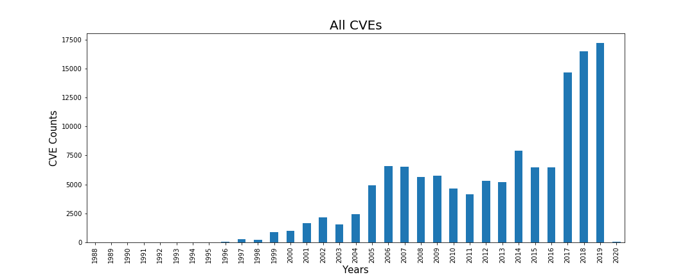
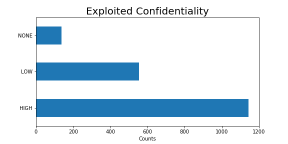
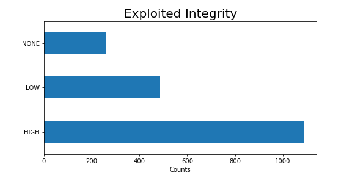

# Machine Learning Engineer Nanodegree

## Capstone Project

Kenneth R. Farr III

July 28th, 2018

## I. Definition

### Project Overview

Cyber Security is the domain that focuses on cost-effectively reducing losses in and around digital assets.  This includes accidental losses caused by mistakenly emailing confidential information, and malicious losses such as a stolen mobile device or a breached database.  A popular modeling technique for computing the risk (dollars lost per year) of an asset is the [Factor Analysis of Information Risk (FAIR)](https://en.wikipedia.org/wiki/Factor_analysis_of_information_risk) ontology.  This model accepts as input the frequency of a loss event (how often a loss is expected to occur) and the loss magnitude (when a loss occurs, how much does it cost the organization).

A Cyber security industry standard exists to catalog all known vulnerabilities:  [Common Vulnerabilities and Exposures (CVE)](https://cve.mitre.org/).  The CVE list details every known vulnerability and applies attributes to them, such as level of involvement to exploit, closeness to the asset (physical presence, adjacent network, internet) etc.  These elemental attributes are used to derive a Common Vulnerability Scoring System (CVSS) score.

The annual [Verizon Data Breach Investigations Report (VDBIR)](https://www.verizonenterprise.com/verizon-insights-lab/dbir/) is highly regarded by Cyber Security Professionals and in the 2015 report, page 21 stated that “...we agree with RISK I/O’s finding that a CVE being added to Metasploit is probably the single most reliable predictor of exploitation in the wild”.  [Metasploit DB (MDB)](https://www.rapid7.com/db/modules/) contains publicly available exploits and is freely searchable.

As a member of a Research and Product Development team for the leading Cyber Security Risk Quantification Company, this kind of research (predicting exploits) is both interesting and important to our work.

This project attempts to predict whether a vulnerability (CVE) will eventually have an exploit created for it.

### Problem Statement

In a business landscape, prioritizing capital investments is critical to maintaining a competitive advantage.  A portion of all capital expenditures include risk reduction, and cyber security is no exception.  It would be cost-prohibitive for a business to attempt to effectively patch every system against every vulnerability, therefore a business must prioritize which vulnerabilities get patched.  

With over 5000 new CVE entries per year, a business must determine which vulnerabilities affect them, and by predicting which of these new vulnerabilities will most likely result in a usable exploit, the business can prioritize their patching efforts.

Utilizing predictive machine-learning algorithms, this research attempts to pinpoint which vulnerabilities are most likely to become usable exploits, helping prioritize which systems need priority patching.  When a vulnerability is discovered and a CVE is created for it, attributes are assigned to the CVE that help determine the type and severity of the vulnerability.  These attributes are:

* _Attack/Access Vector_: Level of access to vulnerable system, includes Physical Access, Local Access, Adjacent Access, or Network (Remote) Access
* _Attack Complexity_: Whether or not extenuating circumstances are required to exploit the vulnerability, includes Low or High
* _Authentication/Privileges Required_: Whether or not access credentials are required before the vulnerability can be exploited, includes None, Low, and High
* _Confidentiality_: Measures the impact to underlying system if the vulnerability is exploited, includes None, Low, and High
* _Integrity_: Measures whether an exploit would affect the system's level of trustworthiness, includes None, Low, and High
* _Availability_: If exploited, would the general availability of the system be impacted, includes None, Low, and High 

It is hypothesized that these attributes provide enough variability and insight into the nature and exploitability of a vulnerability to provide a preemptive prediction and allow priority patching to reduce exposure to exploits.

### Metrics

Much like cancer detection (general direction, not scale) predicting that a vulnerability will become an exploit has the same class imbalance (more negatives to positives) and the same desire to catch all or as many as possible Positives, allowing for an increase in False Negatives.  When used as a first-level scanner, reducing any True Negatives while catching as many True Positives as possible is the goal.  As such, the model will be designed to allow for a lower precision with a higher recall.  This will be accomplished by using a F-Beta Scoring method.  The level of F-Beta will be evaluated to provide as much meaningful predictability as possible without sacrificing too many False Negatives.  It is expected that Beta will need to be rather high to capture enough of the positive results.  Our dataset is heavily skewed to negatives results (60:1).

The data will be broken into train and test data sets by selecting randomly, and use k=5 cross-fold validation.  While perhaps naïve, the model will not assume that any earlier CVEs will affect any later CVEs.

Three different methodologies will be tested: linear regression, adaboost/decision tree, and support vector machines.  For adaboost/decision tree and the SVM, hyper-parameter tuning will be employed to determine the best training parameters.

## II. Analysis

### CVEs
The CVE dataset provided by Mitre contains quite a bit of information for each vulnerability.  Some of these values may have impact on whether an exploit is created for the vulnerability.  In addition to the CVSS categorical values that are used in this project, the platform and platform versions affected by the vulnerability may be a good indicator of whether the vulnerability is turned into an exploit.  However, due to the free-form nature of these entries, the amount of work, and potentially Natural Language Processing required pushes that portion of the dataset outside the scope of this project.  As such, only the categorical attributes that compose the CVSS score will be used as a way to limit the scope of the project and still provide meaningful results.

The following image shows the raw CVEs as extracted from Mitre's JSON format with only the variables being inspected.

The Metasploit database was merged in, and the report-delay was calculated between the time the CVE was published and the Metasploit Exploit was published.  Data was then sorted by CVE year.

CVEs may have one or both CVSS V3 and CVSS V2 attributes.  Where appropriate these were merged together taking the V3 when available and using V2 when not.  It is expected that V3 is superior by the nature of being newer.  Select older CVEs have had V3 attributes applied, but it wasn't until 2015/2016 did CVEs really start consisting of V3 attributes.

Of the 111,520 CVEs available when data was collected, 102,947 (92%) of them have either V2 or V3 attributes.  The 8,573 (8%) that were missing V2/V3 attributes were sometimes REJECTED CVEs or just incomplete.  These observations were omitted from the population since there is no predictive ability or exploits for these vulnerabilities.

Of the 102,947 kept observations, 29,392 (28%) had V3 attributes and every one (100%) had V2 attributes.  There were no cases where a V3 attribute was available and no V2 attribute.

In the rest of this report, when the CVE population is mentioned as a whole, and without any additional qualifiers, it is expected to be the CVE population that has V2 and/or V3 attributes, the 102,947 mentioned above.

The above figure shows how the number of reported vulnerabilities has increased up to around 2005/2006 and tapered off.  There appears to be an influx in 2017 and it is unknown whether that will carry over into 2018 or not.

The above figure shows the number of exploits per year.  It looks like the number of exploits increases along with the number of vulnerabilities.  Running a correlation test against these datasets shows that there is a strong correlation (0.758) between the number of vulnerabilities in a given year and the number of vulnerabilities.

### CVSS Attributes

There are 6 CVSS Attributes that have categorical properties:

* _Attack/Access Vector_: Level of access to vulnerable system, includes **Physical Access**, **Local Access**, **Adjacent Access**, or **Network (Remote) Access**
* _Attack Complexity_: Whether or not extenuating circumstances are required to exploit the vulnerability, includes **Low** or **High**
* _Authentication/Privileges Required_: Whether or not access credentials are required before the vulnerability can be exploited, includes **None**, **Low**, and **High**
* _Confidentiality_: Measures the impact to underlying system if the vulnerability is exploited, includes **None**, **Low**, and **High**
* _Integrity_: Measures whether an exploit would affect the system's level of trustworthiness, includes **None**, **Low**, and **High**
* _Availability_: If exploited, would the general availability of the system be impacted, includes **None**, **Low**, and **High**

Of these 6, only Confidentiality, Integrity, and Availability differ greatly between exploited vulnerabilities and non-exploited vulnerabilities.

For confidentiality, it appears as if **Complete** and **Partial** confidentiality result in more focus for exploits, which seems to reason that attackers are interested in vulnerabilities that produce the most confidentiality loss as opposed to benign exploits.

In the same vein as confidentiality, exploits targeting vulnerabilities where integrity is listed as **Complete** and **Partial** are also of increased focus.

The same applies to availability for vulnerabilities listed as **Complete** and **Partial** loss of availability.  Exploits targeting **Complete** and **Partial** losses in the  **CIA** triad (Confidentiality, Availability, and Integrity) categories are not at all surprising.  Vulnerabilities often require extensive resources to exploit, going after vulnerabilities that do not disrupt or product data would be of little use.

### Exploit Date

One thought going into this project was that the time between when a vulnerability was published and an exploit was published could be used to gauge the potential lag-time and remove any of the more recent vulnerabilities that are within the expected lag time.  This turned out to be more difficult than expected since there appears to be many exploits that are published before the vulnerability that they attack was published.  

| Lag Statistics |    |
|---------  |-----------:   |
| Count     |       1536    |
| Mean      |   -66 Days    |
| Std-Dev   |   398 Days    |
| Minimum   | -3326 Days    |
| 25%       |   -37 Days    |
| 50%       |    -5 Days    |
| 75%       |    -1 Days    |
| Maximum   |  4465 Days    |

One interpretation for this could be that some exploits are being repurposed for new vulnerabilities as they are released and the exploit date is not updated to reflect this.  It's also possible that the data was not captured correctly, though this seems less plausible.  In any event, the lag time is not usable as originally expected and as such is left for potential future work.

### Algorithms and Techniques

In this section, you will need to discuss the algorithms and techniques you intend to use for solving the problem. You should justify the use of each one based on the characteristics of the problem and the problem domain. Questions to ask yourself when writing this section:
- _Are the algorithms you will use, including any default variables/parameters in the project clearly defined?_
- _Are the techniques to be used thoroughly discussed and justified?_
- _Is it made clear how the input data or datasets will be handled by the algorithms and techniques chosen?_

### Benchmark

In this section, you will need to provide a clearly defined benchmark result or threshold for comparing across performances obtained by your solution. The reasoning behind the benchmark (in the case where it is not an established result) should be discussed. Questions to ask yourself when writing this section:
- _Has some result or value been provided that acts as a benchmark for measuring performance?_
- _Is it clear how this result or value was obtained (whether by data or by hypothesis)?_

## III. Methodology

_(approx. 3-5 pages)_

### Data Preprocessing

In this section, all of your preprocessing steps will need to be clearly documented, if any were necessary. From the previous section, any of the abnormalities or characteristics that you identified about the dataset will be addressed and corrected here. Questions to ask yourself when writing this section:
- _If the algorithms chosen require preprocessing steps like feature selection or feature transformations, have they been properly documented?_
- _Based on the **Data Exploration** section, if there were abnormalities or characteristics that needed to be addressed, have they been properly corrected?_
- _If no preprocessing is needed, has it been made clear why?_

### Implementation

In this section, the process for which metrics, algorithms, and techniques that you implemented for the given data will need to be clearly documented. It should be abundantly clear how the implementation was carried out, and discussion should be made regarding any complications that occurred during this process. Questions to ask yourself when writing this section:
- _Is it made clear how the algorithms and techniques were implemented with the given datasets or input data?_
- _Were there any complications with the original metrics or techniques that required changing prior to acquiring a solution?_
- _Was there any part of the coding process (e.g., writing complicated functions) that should be documented?_

### Refinement

In this section, you will need to discuss the process of improvement you made upon the algorithms and techniques you used in your implementation. For example, adjusting parameters for certain models to acquire improved solutions would fall under the refinement category. Your initial and final solutions should be reported, as well as any significant intermediate results as necessary. Questions to ask yourself when writing this section:
- _Has an initial solution been found and clearly reported?_
- _Is the process of improvement clearly documented, such as what techniques were used?_
- _Are intermediate and final solutions clearly reported as the process is improved?_

## IV. Results

_(approx. 2-3 pages)_

### Model Evaluation and Validation

In this section, the final model and any supporting qualities should be evaluated in detail. It should be clear how the final model was derived and why this model was chosen. In addition, some type of analysis should be used to validate the robustness of this model and its solution, such as manipulating the input data or environment to see how the model’s solution is affected (this is called sensitivity analysis). Questions to ask yourself when writing this section:
- _Is the final model reasonable and aligning with solution expectations? Are the final parameters of the model appropriate?_
- _Has the final model been tested with various inputs to evaluate whether the model generalizes well to unseen data?_
- _Is the model robust enough for the problem? Do small perturbations (changes) in training data or the input space greatly affect the results?_
- _Can results found from the model be trusted?_

### Justification

In this section, your model’s final solution and its results should be compared to the benchmark you established earlier in the project using some type of statistical analysis. You should also justify whether these results and the solution are significant enough to have solved the problem posed in the project. Questions to ask yourself when writing this section:
- _Are the final results found stronger than the benchmark result reported earlier?_
- _Have you thoroughly analyzed and discussed the final solution?_
- _Is the final solution significant enough to have solved the problem?_

## V. Conclusion

_(approx. 1-2 pages)_

### Free-Form Visualization

In this section, you will need to provide some form of visualization that emphasizes an important quality about the project. It is much more free-form, but should reasonably support a significant result or characteristic about the problem that you want to discuss. Questions to ask yourself when writing this section:
- _Have you visualized a relevant or important quality about the problem, dataset, input data, or results?_
- _Is the visualization thoroughly analyzed and discussed?_
- _If a plot is provided, are the axes, title, and datum clearly defined?_

### Reflection

In this section, you will summarize the entire end-to-end problem solution and discuss one or two particular aspects of the project you found interesting or difficult. You are expected to reflect on the project as a whole to show that you have a firm understanding of the entire process employed in your work. Questions to ask yourself when writing this section:
- _Have you thoroughly summarized the entire process you used for this project?_
- _Were there any interesting aspects of the project?_
- _Were there any difficult aspects of the project?_
- _Does the final model and solution fit your expectations for the problem, and should it be used in a general setting to solve these types of problems?_

### Improvement

In this section, you will need to provide discussion as to how one aspect of the implementation you designed could be improved. As an example, consider ways your implementation can be made more general, and what would need to be modified. You do not need to make this improvement, but the potential solutions resulting from these changes are considered and compared/contrasted to your current solution. Questions to ask yourself when writing this section:
- _Are there further improvements that could be made on the algorithms or techniques you used in this project?_
- _Were there algorithms or techniques you researched that you did not know how to implement, but would consider using if you knew how?_
- _If you used your final solution as the new benchmark, do you think an even better solution exists?_

### Future Work

CPEs,
exploit-cpe lag publish
-----------

**Before submitting, ask yourself. . .**

- Does the project report you’ve written follow a well-organized structure similar to that of the project template?
- Is each section (particularly **Analysis** and **Methodology**) written in a clear, concise and specific fashion? Are there any ambiguous terms or phrases that need clarification?
- Would the intended audience of your project be able to understand your analysis, methods, and results?
- Have you properly proof-read your project report to assure there are minimal grammatical and spelling mistakes?
- Are all the resources used for this project correctly cited and referenced?
- Is the code that implements your solution easily readable and properly commented?
- Does the code execute without error and produce results similar to those reported?